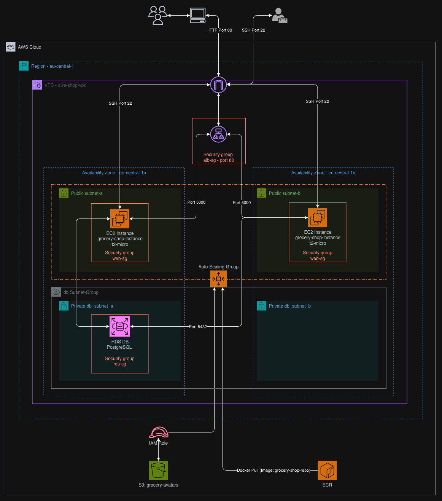

# 🛒 AWS Grocery Shop Infrastructure (High Availability & Scalability)

This project demonstrates a production-ready, highly available 3-tier cloud infrastructure on AWS. It was developed as part of the **Masterschool Cloud Engineering** Track to showcase modern DevOps and Cloud Architecture principles using Terraform (IaC), Docker, and AWS Managed Services.

---

## 🏗 Architecture & Approach

The core objective was to build a resilient and scalable environment for a web application. The architecture is focusing on operational excellence and security prioritizing as well as reliability and cost-efficiency.

### 🖼 Infrastructure Diagram


---

## 🔍 Architectural Breakdown

### 🌐 Networking & Security
* **VPC Design:** A custom VPC (`aws-shop-vpc`) architected across two Availability Zones (`eu-central-1a` & `eu-central-1b`) to eliminate a Single Point of Failure.
* **Isolation Strategy:** While instances reside in public subnets to avoid NAT Gateway costs, they are protected by a **layered Security Group model**. Only traffic originating from the Load Balancer is permitted to reach the application port (Zero Trust approach).

### ⚖️ High Availability & Load Balancing
* **Traffic Distribution:** An **Application Load Balancer (ALB)** serves as the single entry point, offloading SSL/TLS (readiness) and performing continuous **Health Checks** on the backend fleet.
* **Redundancy:** By spanning the ALB and EC2 instances across multiple AZs, the application remains operational even if an entire AWS data center experiences an outage.

### 📈 Resilience & Scalability
* **Auto-Scaling Group (ASG):** The compute layer is fully elastic. The ASG monitors CPU utilization and automatically launches or terminates instances to match real-time demand up to four instances, ensuring consistent performance during traffic spikes.
* **Statelessness:** By offloading user assets to **S3 (grocery-avatars)**, the EC2 instances remain stateless. This allows the ASG to destroy and recreate instances at any time without data loss.

### 🗄️ Data Integrity
* **Managed Persistence:** A **PostgreSQL RDS** instance is deployed in a dedicated Private Subnet Group. This ensures the database is never exposed to the public internet, accessible only by the application tier.
* **Fast Recovery:** Deployment is streamlined using **RDS Snapshots**, allowing for a pre-seeded database environment that is ready for production immediately after the Terraform apply.

---

## 🛠 AWS Service & Deployment Logic

This project follows a professional DevOps lifecycle by separating the **Management Foundation** from the **Application Artifacts** and the **Cloud Infrastructure**. This ensures that the environment is modular, secure, and easy to maintain.

### 🏗 Phase 1: Bootstrap (Remote Backend Setup)
[*Click here to view the Bootstrap code.*](./bootstrap/main.tf) 

The primary goal of this phase is to move away from a "Local Workflow" to a "Cloud-Native Workflow." Before deploying any application resources, we must establish a **Remote Backend**.
Additionally, I provision the Amazon ECR repository here to ensure a secure "landing zone" for the Docker image before the main infrastructure rollout begins.

#### Why doing this?
* **Transition from Local to Remote:** By default, Terraform stores the `terraform.tfstate` file on your local machine. This is dangerous for production. If your computer fails or the file is deleted, Terraform "forgets" your infrastructure. 
* **Single Source of Truth:** Storing the state in **S3** ensures that the infrastructure's configuration is persistent, versioned, and accessible from anywhere—not just your local environment.
* **Collaboration & Locking:** To prevent "Race Conditions" (two people changing the same resource at once), we implement **DynamoDB State Locking**. This acts as a safeguard, ensuring only one deployment process can run at a time, preventing state corruption.

| Service           | Role in Bootstrap  | Why it's Essential                                                                     |
|:------------------|:-------------------|:---------------------------------------------------------------------------------------|
| **S3 (tf-state)** | **Remote Storage** | Moves the state file from your local disk to a secure, versioned cloud location.       |
| **DynamoDB**      | **State Locking**  | Prevents concurrent executions that could lead to conflicting infrastructure changes.  |
| **ECR**           | **Image Registry** | Provides a private, secure place to store and version Docker images before deployment. |

---

###  🚢 Phase 2: Application Containerization (Manual Bridge)
To bridge the gap between application code and cloud infrastructure, I decided to use a manual **Docker-to-ECR workflow**. This step ensures the latest version of the Grocery Shop application is available for the cloud environment.
* **Process:** The application is containerized into a Docker image, authenticated against AWS, and pushed to the **Amazon ECR** repository created in the initial phase.

#### Why a Manual Bridge?
While enterprise environments typically automate this via CI/CD, I chose a manual workflow to decouple Infrastructure (IaC) from Application Logic. This approach highlights the "handshake" between the two: Terraform prepares the environment, while the Docker workflow provides the versioned artifact. It ensures that the infrastructure remains agnostic of the application's internal build process.
* **Significance:** This demonstrates the decoupling of "Infrastructure" (managed by Terraform) and "Application Code" (managed via Docker).

---

### 🌐 Phase 3: Main Infrastructure (Application Stack)
[*Click here to view the core Infrastructure code.*](./infrastructure/) 

Once the Remote Backend is established and the Docker image is pushed to ECR, Phase 3 deploys the actual 3-tier environment. These resources rely on the S3/DynamoDB foundation to manage their lifecycle securely.

| Service          | Layer           | Purpose                                                                    |
|:-----------------|:----------------|:---------------------------------------------------------------------------|
| **VPC**          | **Networking**  | Provides the isolated network environment.                                 |
| **ALB**          | **Traffic**     | Handles public entry and balances load across the web tier.                |
| **EC2 (ASG)**    | **Compute**     | Runs the dockerized app; scales automatically to ensure High Availability. |
| **RDS**          | **Database**    | Managed PostgreSQL, strictly isolated in private subnets.                  |
| **S3 (avatars)** | **App Storage** | Stores user assets, allowing EC2 instances to remain "stateless."          |
| **IAM**          | **Security**    | Manages cross-service permissions (e.g., EC2 pulling from ECR).            |

---

## 📜 Infrastructure as Code (Terraform)

### 📂 Terraform Structure

```
.
bootstrap
├── main.tf
infrastructure
├── asg_alb.tf
├── database.tf
├── iam.tf
├── network.tf
├── outputs.tf
├── provider.tf
├── s3.tf
└── variables.tf
```

---

## 💡 Design Decisions & Challenges

### 1. Networking & Security Trade-offs

From a security standpoint, the EC2 instances should ideally reside in a Private Subnet. This would require a NAT Gateway to allow the instances to reach the internet for Docker pulls (ECR) and OS updates.

* **Decision:** Within the scope of the Masterschool program, a NAT Gateway was not utilized due to its significant hourly costs. Instead, I launched the instances in Public Subnets but implemented a strict **"Zero Trust" Security Group policy**: the instances only accept incoming traffic **only** from the ALB's Security Group on the application port.

### 2. High Availability Networking for RDS

You will notice a second private database subnet (`db_subnet_b`) in a different Availability Zone. While the database currently runs as a Single-AZ instance to remain within the Free Tier, AWS requires a DB Subnet Group to span at least two Availability Zones. This design ensures that the infrastructure is "Multi-AZ Ready"—allowing for a seamless transition to a high-availability failover configuration with a single configuration toggle.

### 3. Data Seeding via Snapshots

To ensure a fast and reliable deployment of the database, I decided to work with **RDS Snapshots**. Instead of manual SQL seeding, a pre-configured snapshot containing dummy entries is restored. This ensures the application is fully functional and populated with data immediately after deployment.

### 4. Workflow Efficiency: "One-Click" Infrastructure

A key requirement for this project was to ensure the entire environment is fully reproducible and ephemeral.

* **The Goal:** I wanted to be able to spin up the complete 3-tier stack for development and shut it down entirely to avoid unnecessary AWS costs (terraform apply / destroy).
* **The Challenge:** Normally, databases and application states make "clean" redeployments difficult. Re-seeding data or re-configuring container runtimes manually every time would defeat the purpose of IaC.
* **The Solution:**
    * **ECR and User Data:** By separating the Docker image push (Phase 2) from the infrastructure, the EC2 instances can pull the latest version automatically during the boot process.
    * **RDS Snapshot:** By using a pre-seeded snapshot, the database is "production-ready" immediately after the Terraform apply, with no manual SQL imports needed.
---

## 💰 Cost Consideration & Optimization

* **Free Tier Focus:** Used `t2.micro` instances and managed RDS within the Free Tier limits where possible.
* **Cost Avoidance:** Chose Security Group isolation over NAT Gateways to save ~$32/month per gateway.
* **Cleanup:** All resources are tagged for easy tracking and can be destroyed via Terraform to prevent orphaned resource costs.

---

## 🚀 Future Improvements

* **Private Isolation:** Adding a NAT Gateway or VPC Endpoints to move all compute resources to private subnets.
* **CI/CD Integration:** Implementing GitHub Actions to automate the `docker build` -> `push` -> `terraform apply` workflow.
* **Monitoring:** Setting up CloudWatch Dashboards for real-time visibility into traffic and error rates.

---

*Developed as a Capstone Project for the Masterschool Cloud Engineering Program.*